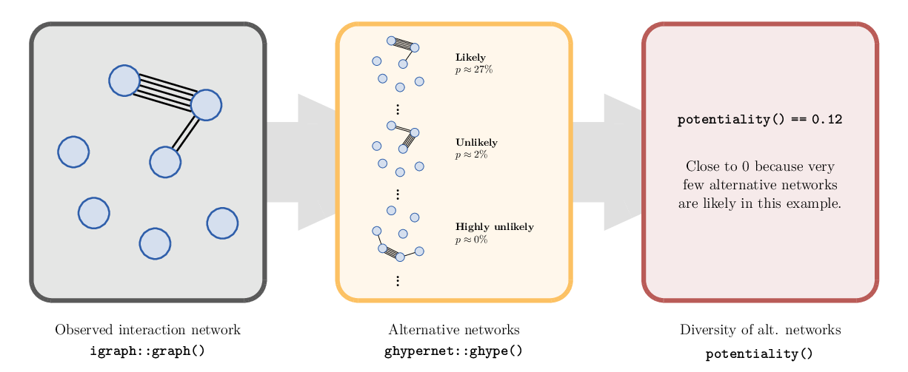

[](https://github.com/CodesByChris/potentiality/actions/workflows/check-release.yaml)
[](https://github.com/CodesByChris/potentiality/actions/workflows/lint.yaml)
[](LICENSE)
[](https://doi.org/10.5281/zenodo.10462630)


# Potentiality

R library to compute the entropy and potentiality of [ghypernet](https://ghyper.net/) network ensembles.



This repository centers around the `potentiality` measure, quantifying a social organization's capacity to achieve diverse interaction configurations.
This measure takes a multi-edge network as input, where nodes represent individuals and (multi-)edges their multiple interactions.
It employs the generalized hypergeometric ensemble of random graphs ([ghypernet](https://ghyper.net/)) to determine alternative interaction networks and their probabilities relative to the input network.
The `potentiality` is calculated as the normalized Shannon entropy of this network ensemble, measuring the diversity of networks in it.
This repository provides an accessible implementation of the measure.

Key features:
- Quantify an organization's potential to attain various interaction configurations.
- Compare different organizations and stages of an organization's development.
- Utilize a robust measure based on a closed-form probability distribution.

The research underlying this repository was presented in the research paper
*"What Is the Entropy of a Social Organization?"* by Christian Zingg, Giona Casiraghi, Giacomo Vaccario, and Frank Schweitzer, published in the journal *Entropy (2019, 21(9), 901; doi:10.3390/e21090901)*.


## Installation

The package can be installed directly from GitHub with the following R commands:

```R
library(devtools)

# Install latest release version
install_github("CodesByChris/potentiality", ref = github_release())

# Or: Install latest development version
# install_github("CodesByChris/potentiality")
```


## Usage

This repository provides two R functions:
- `potentiality`: computes a social organization's potentiality from a given (i) interaction network or (ii) `ghype` ensemble.
    Option (i) computes the potentiality as explained in Section 3 of *Zingg et al. (2019)* and internally fits the `ghype` ensemble for the potentiality computation.
    However, this approach may overfit networks with very many nodes.
    For such cases, option (ii) gives the users more control over the fitting process of the `ghype` ensemble, for example, enabling them to fit groups of nodes instead of individual nodes (see also [bccm](https://ghyper.net/reference/bccm.html)).
    `potentiality` is computed according to equation (10) in *Zingg et al. (2019)*.
- `entropy_ghype`: computes an approximate Shannon entropy of a [ghype ensemble](https://github.com/gi0na/r-ghypernet).
    The approximate Shannon entropy is computed according to equations (7) and (8) in *Zingg et al. (2019)*.
    `entropy_ghype` corresponds to `potentiality` with the exception that it is not normalized to the interval $[0, 1]$.


## Examples

To compute the potentiality of the Karate Club, you can proceed as follows:

```R
library(potentiality)
library(magrittr)
library(igraph)

data(karate, package = "igraphdata")

# Convert karate from weighted to multiedge
karate_multi <- karate %>%
    get.adjacency(attr = "weight", sparse = FALSE) %>%
    graph_from_adjacency_matrix(mode = "undirected")

# Compute potentiality
potentiality(karate_multi)  # 0.31, see Table 1 in Zingg et al. (2019)
```


## Contributors

The code in this repository has been developed by

- Christian Zingg
- Giona Casiraghi

at the Chair of Systems Design, ETH Zurich.


## Copyright

This repository is released under the GNU Affero General Public License v3.0

Copyright 2019-2023, ETH Zurich.
